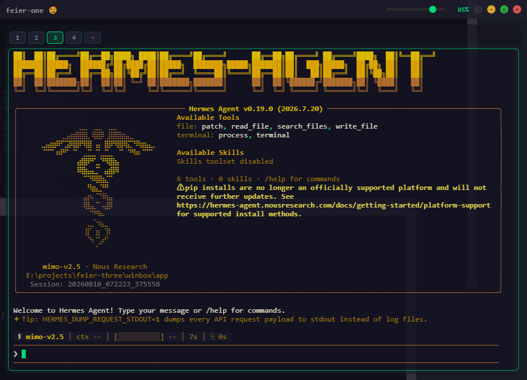
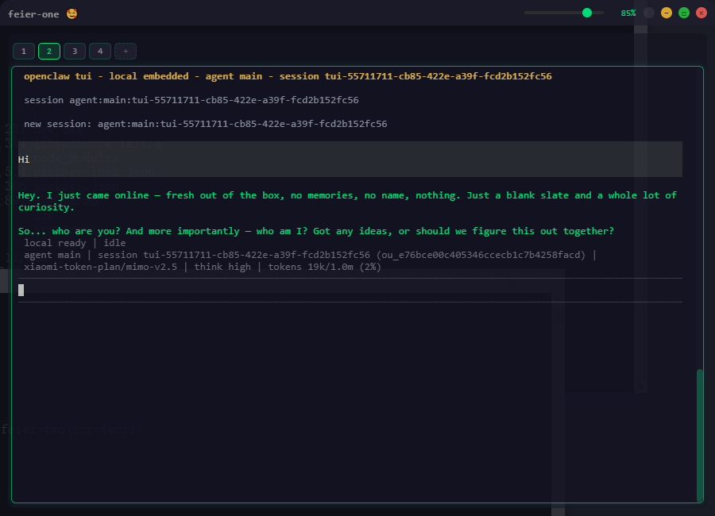

# winux

> **A Linux Shell for Windows that runs Claude Code, Codex, OpenClaw, Hermes, OpenCode & Kimi Code — no WSL needed.**





## 设计原则：自包含的独立子系统

winux 内的 winbox 是一个**完全独立、自包含的 Linux 风格子系统**，与 Windows 上的
node/python/npm 等工具链**没有任何依赖关系**：

- node、npm、python、uv 全部内置于 `winbox/bin/`，随 winbox 一起分发；
  目标机器上**有没有装 Windows 版 node/python 都无所谓**，装了也与 winbox 完全无关
- 终端 shell 的 PATH 以 `winbox/bin`、`winbox/bin/nodejs` 优先，子系统内执行的
  `node`/`python`/`npm`/`uv` 永远是 winbox 自带的，不会落到 Windows 的安装
- npm 全局安装目录（`npm_config_prefix`）强制指向 `winbox/bin/nodejs`，
  npm 缓存（`npm_config_cache`）指向 `winbox/app/.npm-cache`——即使用户的
  `.npmrc` 写了 `prefix=...` 也不影响（环境变量优先级更高）
- HOME/USERPROFILE/TMPDIR 全部重定向到 winbox 内部；uv 工具装进 `winbox/bin`

后果：winbox 目录整体拷贝/打包到任何 Windows 机器都能用，不依赖目标机的
node/python/npm 环境。

## 安装

```bash
npm install
init.bat
```

## 运行

```bash
start.bat
```
